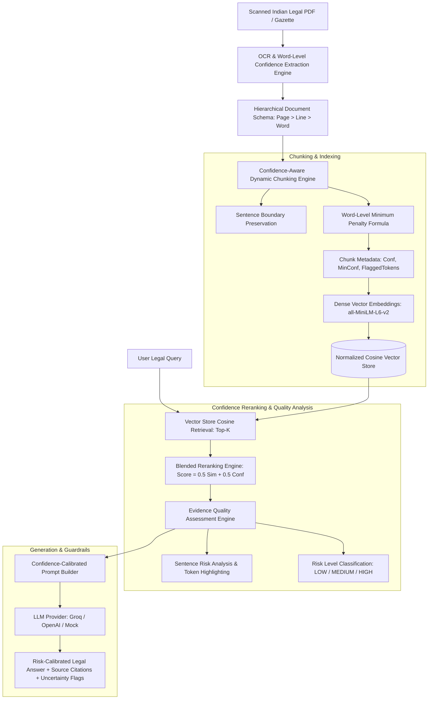

# System Architecture: Confidence-Aware RAG for Indian Legal Documents

## 1. Problem Definition & Architectural Motivation

Standard Retrieval-Augmented Generation (RAG) pipelines operate under the flawed assumption that extracted document text is **ground truth**. However, in the Indian legal and administrative ecosystem:
- Court orders, gazette notifications, RTI replies, and land records are frequently scanned on low-grade paper, watermarked, stamped, or digitally degraded over decades of archiving.
- OCR engines (Tesseract, PyMuPDF, Surya, PaddleOCR) introduce character distortions: `₹25,000` is corrupted to `₹75,000` or `₹25,O0O`; limitation period `45 days` is corrupted to `15 days`; `Section 420` becomes `Section 428`.
- **Standard Naive RAG Failure Mode**: Embeddings map distorted strings to similar semantic vector clusters. The LLM receives the corrupted text without uncertainty context and confidently outputs legally catastrophic answers (**Silent OCR Hallucination**).

The **Confidence-Aware RAG Architecture** treats OCR uncertainty as a **first-class signal** that is propagated end-to-end through chunking, indexing, reranking, evidence analysis, and generation.

---

## 2. End-to-End Pipeline Diagram

---

## 3. Mathematical Formulations

### 3.1 OCR Token Confidence Clamping & Line Aggregation
Let word $w_i$ have raw OCR confidence $c_{\text{raw}}(w_i) \in [0, 100]$.
$$c(w_i) = \text{clamp}\left(\frac{c_{\text{raw}}(w_i)}{100.0}, 0.0, 1.0\right)$$
For a line $L = \{w_1, w_2, \dots, w_m\}$:
$$c(L) = \frac{1}{m} \sum_{i=1}^m c(w_i)$$

### 3.2 Dynamic Chunk Confidence with Weakest-Link Penalty
Let chunk $C = \{w_1, w_2, \dots, w_N\}$ contain $N$ words. The base average is:
$$\mu_{\text{conf}}(C) = \frac{1}{N} \sum_{i=1}^N c(w_i)$$
To prevent a single corrupted statutory figure or date from being concealed by 50 high-confidence common words, we apply a weakest-link penalty:
$$c(C) = \max\left(0.0, \, \mu_{\text{conf}}(C) - 0.15 \cdot \left(1.0 - \min_{1 \le i \le N} c(w_i)\right)\right)$$

### 3.3 Blended Retrieval Reranking Function
Given user query vector $v_q$ and candidate chunk vector $v_c$:
$$\text{Sim}_{\text{cosine}}(q, c) = \frac{v_q \cdot v_c}{\|v_q\| \|v_c\|}$$
The composite ranking score is:
$$S(q, c) = \alpha \cdot \text{Sim}_{\text{cosine}}(q, c) + \beta \cdot c(c)$$
*Default parameters*: $\alpha = 0.50$, $\beta = 0.50$ (where $\alpha + \beta = 1.0$).

### 3.4 Overall Evidence Risk Formulation
For retrieved evidence set $E = \{c_1, c_2, \dots, c_k\}$:
$$R(E) = \begin{cases}
\text{HIGH\_RISK}, & \text{if } \min_{c \in E} c(c) < 0.50 \text{ or } \text{FlaggedTokens}(E) > 0 \\
\text{MEDIUM\_RISK}, & \text{if } 0.50 \le \frac{1}{|E|}\sum_{c \in E} c(c) < 0.80 \\
\text{LOW\_RISK}, & \text{otherwise}
\end{cases}$$

---

## 4. Component Modules & Code Architecture

| Layer | Implementation File | Key Role & Responsibilities |
| :--- | :--- | :--- |
| **Config & Core** | `backend/app/core/config.py` | Pydantic v2 settings, weights ($\alpha, \beta$), directories |
| **OCR Service** | `backend/app/services/ocr_service.py` | PyMuPDF / Tesseract token confidence extraction |
| **Chunking Engine** | `backend/app/services/chunking_service.py` | Word-level penalty calculation, sentence boundary preservation |
| **Vector Repository** | `backend/app/repositories/vector_store.py` | In-memory / FAISS cosine vector store with thread safety |
| **Reranking Engine** | `backend/app/services/retrieval_service.py` | Blended scoring & confidence ranking inversion |
| **Evidence Analyzer** | `backend/app/services/evidence_service.py` | Token-level flagged word mapping & risk categorization |
| **LLM Service** | `backend/app/services/llm_service.py` | Prompt augmentation, Groq / OpenAI / Mock multi-provider |
| **REST API Layer** | `backend/app/api/v1/endpoints/` | Ingestion, single query, side-by-side comparison, CRUD |
| **Degradation Suite**| `evaluation/degrade_document.py` | Synthetic optical noise engine (blur, noise, fading, compression) |
| **Evaluation Suite** | `evaluation/evaluate.py` | Automated 4-tier benchmark runner with accuracy & hallucination metrics |
| **React Interface** | `frontend/src/` | Modern UI with light/dark theme, side-by-side comparison, token highlighter |

---

## 5. Key Engineering Design Decisions

1. **Why not run OCR spellcheck/correction (e.g. SymSpell or LLM re-OCR) prior to RAG?**
   - *Reasoning*: In legal documents, proper nouns (Khasra numbers, village names, litigant surnames, statute sections) are out-of-vocabulary (OOV). Autocorrecting `Khasra 312` to `Khasra 310` introduces irreversible factual corruption. Preserving raw text with an explicit confidence score and warning the human reviewer is the legally sound design.
2. **Why blended reranking over strict hard-filtering?**
   - *Reasoning*: If an older 1990 gazette scan is the **only** document in the repository answering a query, hard-filtering chunks with confidence $< 0.80$ produces a zero-retrieval failure. Blended reranking retrieves the chunk, but annotates it with high-risk warnings and token-level caution flags.
